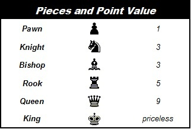
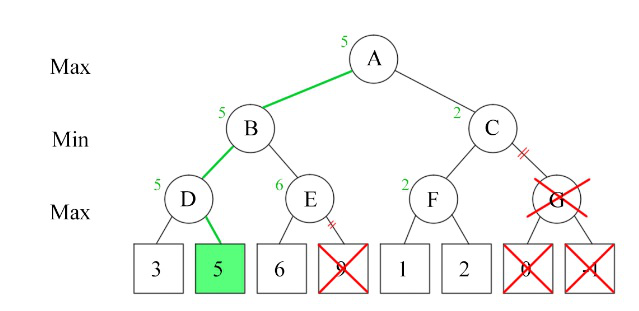
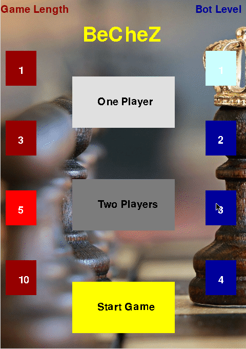
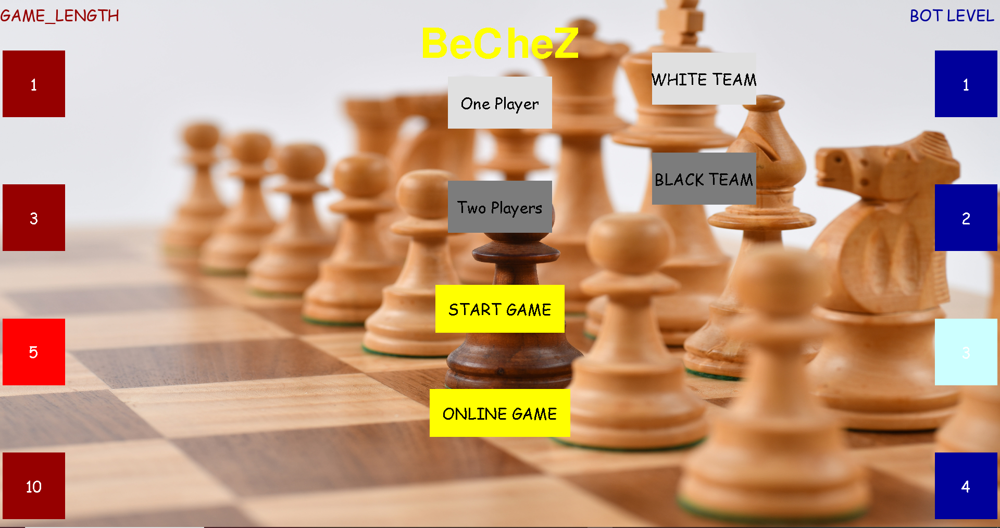
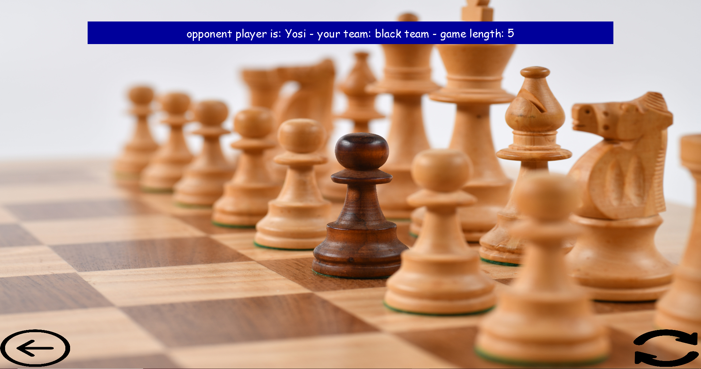
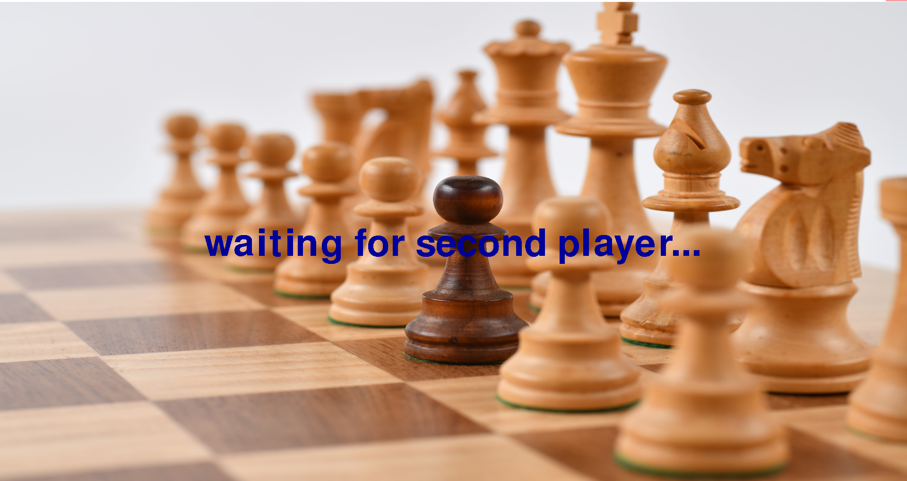

# BeCheZ
Chess game with pygame library made from zero.
The game has an AI engine option.

## Why I Did This Project
That's was my first python project.
I did this project because I love chess and I wanted to practice and test my python skills.

## Build status
the project is ready to use.

## How To Use
All you need is python, pygame package and my code :)
Run the commands below to install and run the game.
```bash
git clone https://github.com/guykrinsky/BeCheZ.git
pip install pygame
python main.py
```
if you want to play an online game, first you have to run server.py.
After that you need to change the ip of the server in protocol.py, and than you can play.

## Bot's Algorithm
First thing, every piece has a score that represent it's value, this is the base of the engine.



In addition, a knight in the corner of the board doesn't equal to a knight in the center, so the piece's score dependents on it's position.

The score of the game is the sum of the white team's pieces minus black team's pieces,
the black player want the score to be **minimal** and the white **maximal**.

This is how the bot works, for every move he can do he checks every white team move, and for every white move he checks his own moves,
and so on until 1 to 5 future moves. Every player will do his best move, white player will want to do a move that lead 
to max score and the black player to the min score.
That called **min-max algorithm**.


If you still don't understand and you want to hear more - (https://www.geeksforgeeks.org/minimax-algorithm-in-game-theory-set-1-introduction/) 

This isn't over ;), we can disqualify some paths by **Alpha–beta pruning**. 
This part is more complex, you can read here the more boring staff: (https://en.wikipedia.org/wiki/Alpha%E2%80%93beta_pruning).


## ONLINE OPTION
After one yaer I got back to the project.
I learned about network in python, And I wanted to upgrade my chess project to have an online option.
Every client communicate with the server. there isn't a piece of information that being directly send from one client to other.
The communication with the server is done by using the protocol, both sides.
Since my computer doesn't have an public IP, I can only play against other computer at the local server.
Because I run server.py only in my local server, if you want to play an online game, first you have to run server.py.
After that you need to change the ip of the server in main.py, and than you can play.

I change the opponening screen for the online game, and switch to full screen so the gamplay isn't updated.
## Gameplay


## Opening Screen
menu screen:



online screen:


join game screen:


create game screen:

