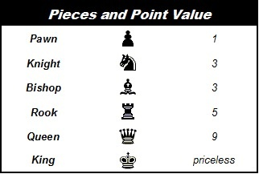
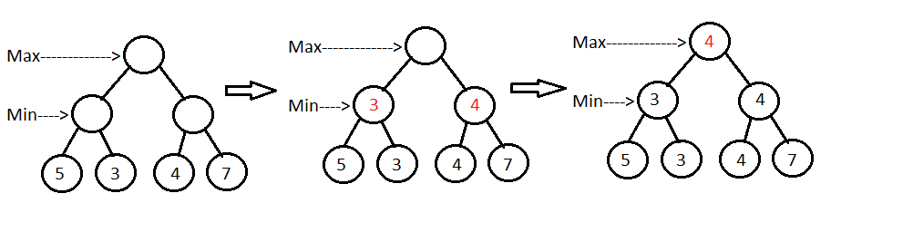
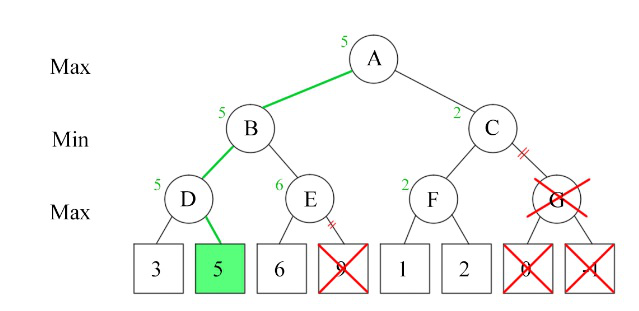
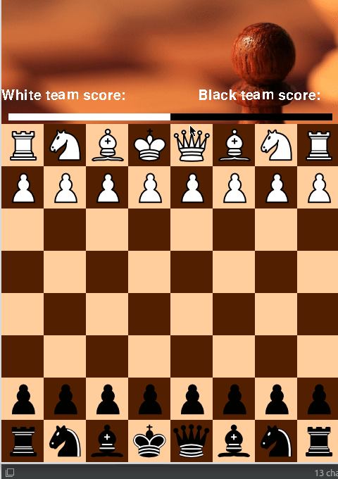

# Chess
Chess game with pygame library made from zero.
The game has an AI engine option.

## On The Project
Thats was my first python project.
I did this project because I love chess and i wanted to practice and test my python skills.

## How To Use
You just need to downold pygame libary and python-3 and off course all the images and the program.

## How bot works
First thing, every piece got score that represnt his value, this is the base of the engine.

In addition, knight in the corner of the board doesn't equal to knight in the middel, so the piece's score dependent on his position.

The score of the game represented by the sum of the white team's pieces minus black team's pieces,
the black player want the score to be **minimal** and the white **max**.

This is how the bot works, for every move he can do he checks every white team move, and for every white move he checks his own moves, and so on until 1 - 5 future moves. Every player will do his best move, white player will want to do a move that lead to max score and the black player to the min score.
That called min-max algorithem.

maybe there wiil have a better eplanition - (https://www.geeksforgeeks.org/minimax-algorithm-in-game-theory-set-1-introduction/) 

This isn't over ;), we can disqualify some roots by, **Alpha–beta pruning**. that s little bit hard to explain in words (maybe there - (https://en.wikipedia.org/wiki/Alpha%E2%80%93beta_pruning)). But there are roots we dont need to check.

## Images
<!--- TODO add screen shots of the game --->

